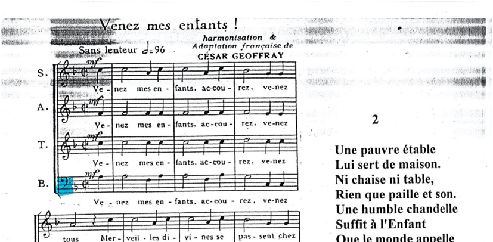
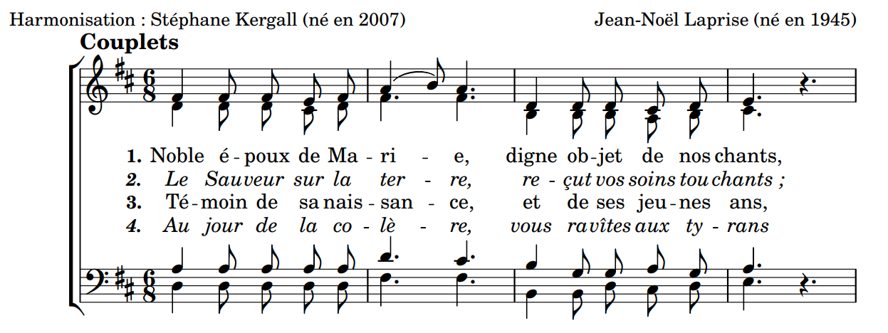

[français](../README.md)
# <a href="mailto:stef.kergall@gmail.com"><b>ergallScore</b></a>

## Features

- **Revamp** an old score photocopied six times over, patched up with LibreOffice scans

| Before | After |
| --- | --- |
|  |  |

- **Hear** what a song sounds like when all you have is the pdf

| Before | After |
| --- | --- |
|  | <video src="readme_medias/Et incarnatus est.mp4" controls width="1000"></video> |

- **Harmonize** a melody found by chance

| Before | After |
| --- | --- |
|  |  |

- **Reduce** the number of pages of a score, or fit two different pieces on the same sheet [(like here)](../08-Assemblages/Jesu%20Salvator%20-%20Jesu%20Rex%20admirabilis/Jesu%20Salvator%20-%20Jesu%20Rex%20admirabilis.pdf)

- **Put together** a complete folder for your choir, table of contents included ([like this one](../99-Commandes/carnet_été/carnet_été.pdf))

KergallScore has solutions for you. [We're waiting for your requests](mailto:stef.kergall@gmail.com) Monday to Saturday!

## Developers

More information [over here](DEVELOPERS.md).

## Legal notice
We produce scores from a variety of independent sources. If one of them turned out not to be free of rights, [let us know immediately](mailto:stef.kergall@gmail.com) so we can protect the work of our fellow musicians.