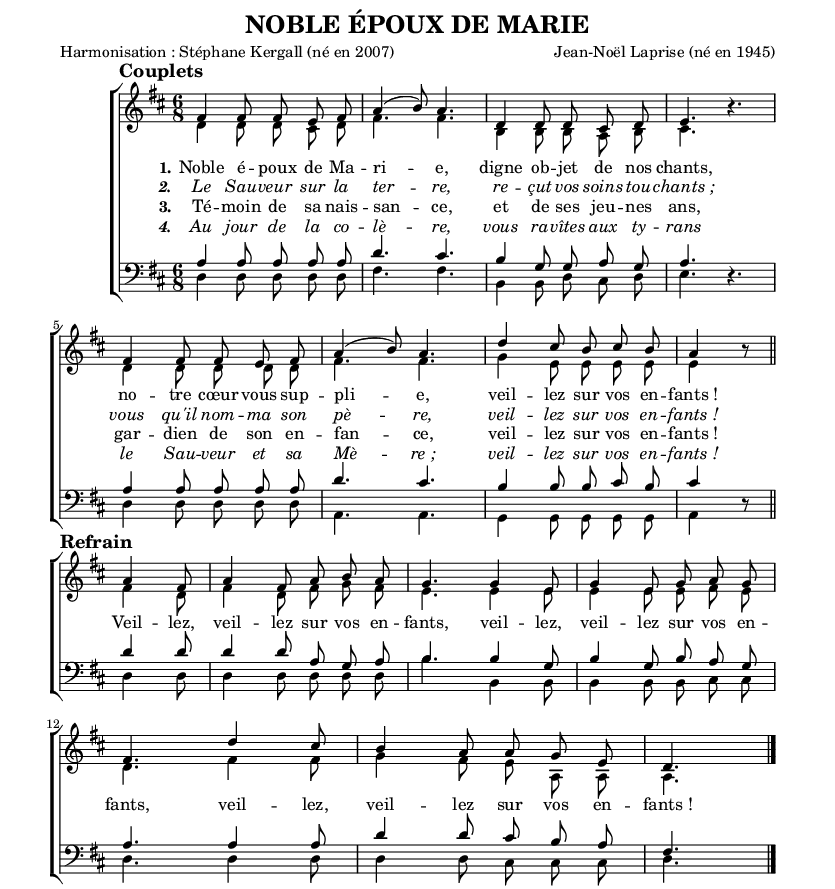

# **KergallScore**

> 🌐 Une base de données musicale 
> ✉️ Vos commandes 
> 🎶 De la musique !

## Vous voulez...

|   | Avant | Après |
| --- | --- | --- |
| **Relooker** une vieille partition, photocopiée plusieurs fois, bricolée avec des scans sur LibreOffice ? |  |  |
| **Ecouter** ce que donnerait un chant dont vous n'avez que le pdf ? |  |  |
| **Harmoniser** une mélodie trouvée par hasard ? |  |  |

## Ou encore...

Vous aimeriez **regrouper** sur une seule feuille un chant que vous possédez sur 6 pages ?\
Vous avez besoin d'un **dossier** complet pour votre chorale, ***avec une table des matières*** ?\
Vous cherchez un **éditeur** à votre dernière composition ?

**KergallScore** propose des solutions. [Envoyez un mail](mailto:stef.kergall@gmail.com) pour profiter au plus vite de ces partitions !
