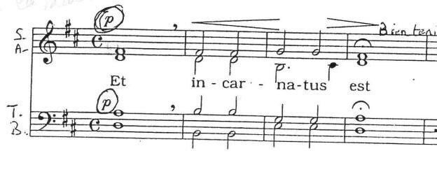
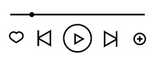
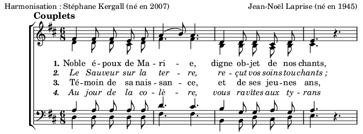

[[english]](.doc/README_en.md)
# <a href="mailto:stef.kergall@gmail.com"><b>ergallScore</b></a>

# Fonctionalités

- **Relooker** une vieille partition photocopiée six fois, montée à coups de scans sur LibreOffice

| Avant | Après |
| --- | --- |
|  |  |

- **Entendre** à quoi ressemble un chant dont vous n'avez que le pdf

| Avant | Après |
| --- | --- |
|  | Et incarnatus est.midi  |

- **Harmoniser** une mélodie trouvée par hasard

| Avant | Après |
| --- | --- |
|  |  |

- **Réduire** le nombre de pages d'une partition, ou mettre sur la même feuille deux pièces différentes [(comme ici)](08-Assemblages/Jesu%20Salvator%20-%20Jesu%20Rex%20admirabilis/Jesu%20Salvator%20-%20Jesu%20Rex%20admirabilis.pdf)

- **Monter** un dossier complet pour votre chorale, avec une table des matières ([comme là](99-Commandes/carnet_été/carnet_été.pdf))

KergallScore vous propose des solutions. [Nous attendons vos commandes](mailto:stef.kergall@gmail.com) du lundi au samedi !

# Développeurs

Plus d'informations [par ici](.doc/DEVELOPERS.md).

# Législation
Nous produisons des partitions à partir de sources variées et indépendantes. Si l'une d'elles se trouvait ne pas être libre de droit, [prévenez-nous immédiatement](mailto:stef.kergall@gmail.com) pour que nous puissions protéger le travail de nos collègues musiciens.
